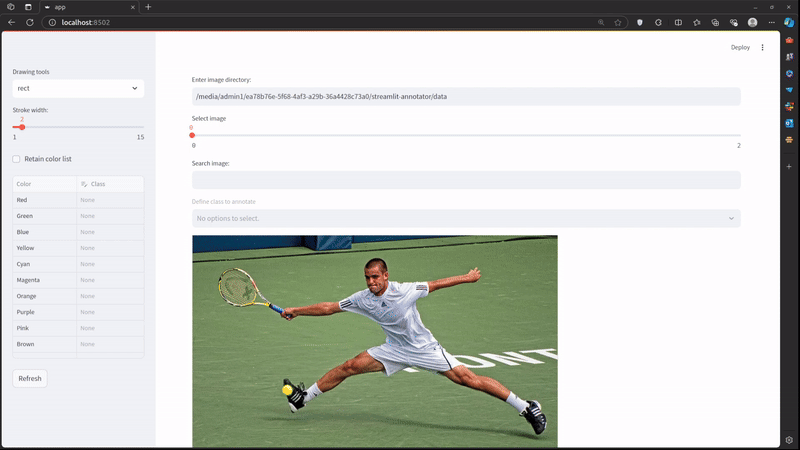
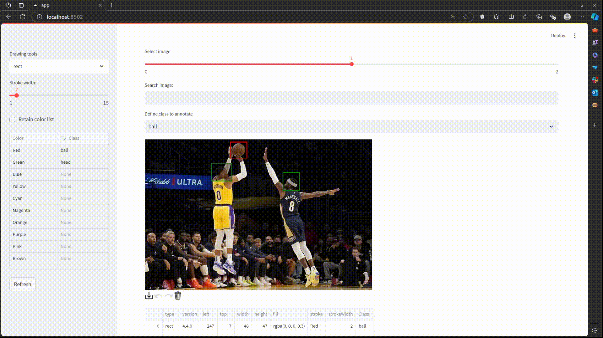

# Streamlit - Annotator
Streamlit Annotator provides an easy-to-use interface for annotating your data, inspired by [streamlit-drawable-canvas](https://github.com/andfanilo/streamlit-drawable-canvas)

## Features
- Easy-to-use interface for annotating images
- Drawing bounding boxes
- Rotating, undoing, redoing, or deleting bounding boxes
- Saving annotation data in canvas JSON format and LabelMe JSON format

## Demo

### Draw bounding box


### Remove bounding box

To remove a bounding box, switch to transform mode and double-click on the box you want to delete.

## Installation
Create a new conda environment and install the required dependencies:
```bash
conda create -n streamlit-annotator python=3.10 -y
conda activate streamlit-annotator
pip install requirements.txt
```

## Usage
Run the Streamlit app:
```python
streamlit run app.py
```
This will launch the Streamlit Annotator interface in your default web browser.